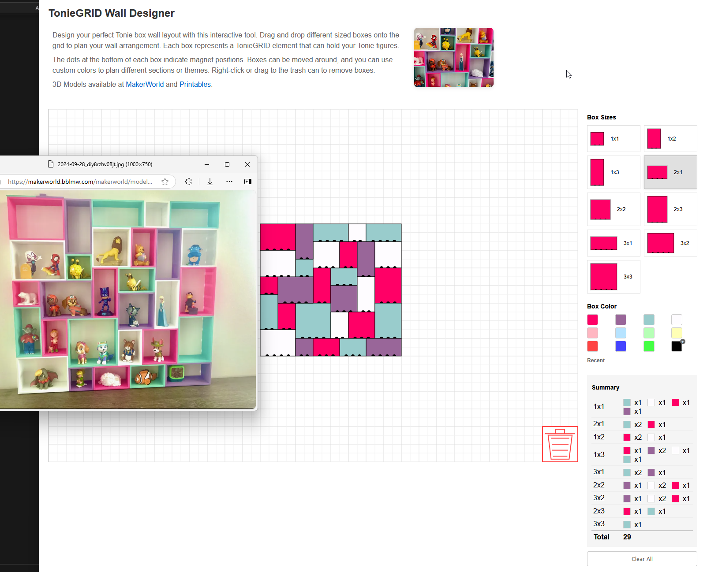

# TonieGRID Wall Designer 🎨

An interactive web tool for designing your TonieGRID wall layout. This tool helps you plan and visualize your TonieGRID arrangement before mounting it on your wall.

🎮 **[Try the Live Designer](https://bashninja.github.io/toniegriddesigner/)** | 🔧 **[View on GitHub](https://github.com/bashNinja/toniegriddesigner)**

## Example Layout 📐

Here's an example of recreating the designer's original layout using the tool:

## Features ✨

- 🎯 Drag and drop different-sized TonieGRID elements
- 🎨 Color customization for different sections/themes
- 🔍 Visual preview of magnet positions
- ✅ Real-time validation of box placements
- 📊 Summary of used elements
- 🗑️ Easy deletion via right-click or drag to trash
- 🧹 Quick cleanup by clicking the trash can

## Usage 🚀

1. Visit the [TonieGRID Wall Designer](https://bashninja.github.io/toniegriddesigner/)
2. Choose a box size from the right panel
3. Drag and drop boxes onto the grid
4. Customize colors using the color picker
5. Right-click or drag to trash to remove boxes
6. Click the trash can to clear all boxes
7. View your layout summary in real-time

## Development 💻

The project is built with vanilla JavaScript and HTML5 Canvas. To run locally:

1. Clone the repository
2. Open `index.html` in your browser
3. No build process or dependencies required

## Get the TonieGRID 🛠️

You can find the 3D models for printing your own TonieGRID:
- [MakerWorld](https://makerworld.com/en/models/668415)
- [Printables](https://www.printables.com/model/935455-toniegrid-modular-shelf-for-tonie-figures-modulare)

## Special Thanks 🙏

A huge thank you to the original TonieGRID designer for creating such an amazing modular system for Tonie figures! This web tool aims to make it easier for everyone to plan their TonieGRID layouts before printing and mounting.

## License 📄

MIT License - Feel free to use and modify as needed. 